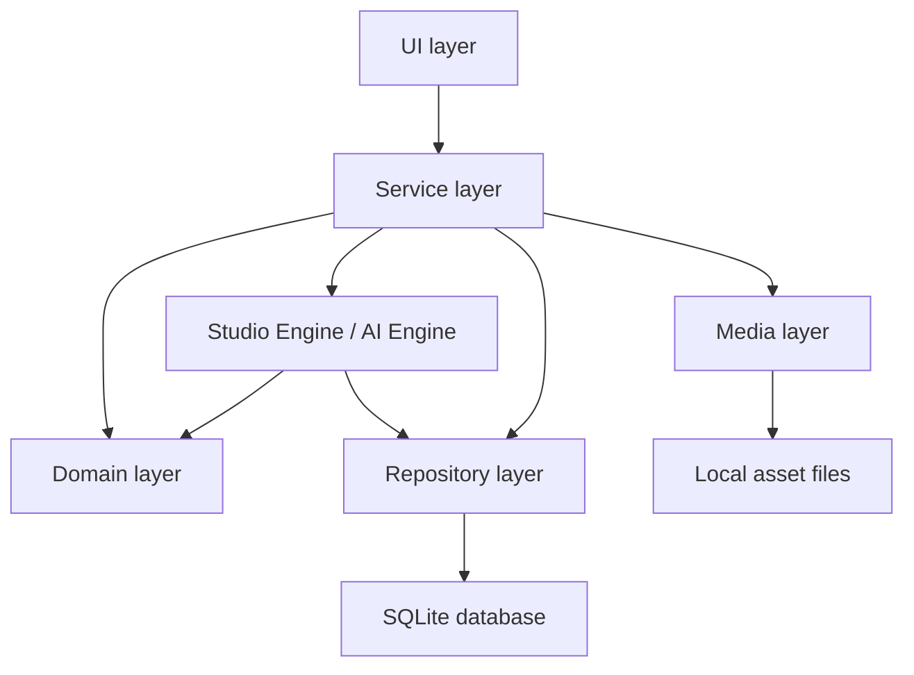
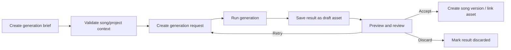
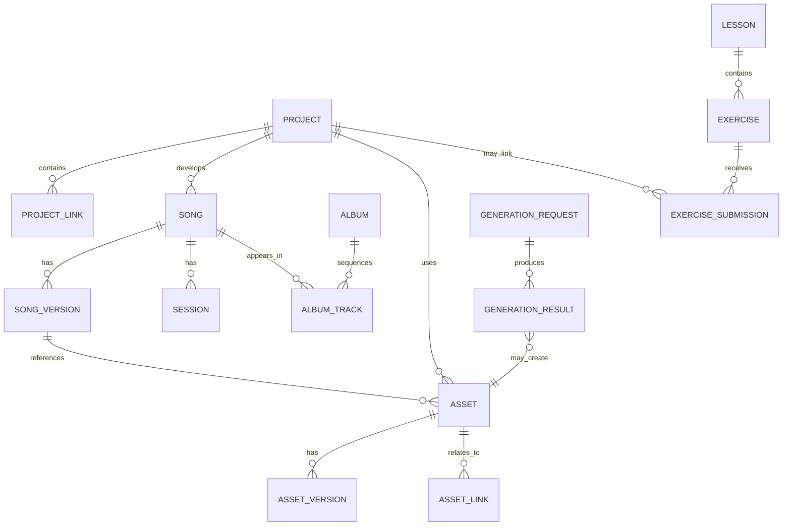

# Silent Crescendo Studio — Current Desktop Architecture

**Scope:** Current desktop application and the next few months of implementation.  
**Audience:** Single-developer product development.  
**Status:** Current-state architecture.

## Purpose

Silent Crescendo Studio is a local-first desktop application for developing music ideas into songs, organizing songs into albums, managing creative projects, and using focused AI assistance during the process.

The application is intentionally simple: one desktop client, one local SQLite database, a local asset library, a small number of clear modules, and direct module-to-module calls. The architecture favors understandable code, recoverable file operations, and versioned creative work over abstraction for its own sake.

## 1. Current folder structure

The application should remain organized by responsibility, with the user interface separate from application rules and persistence.

```text
SilentCrescendoStudio/
├── app/
│   ├── main.py                 # Desktop application startup and composition
│   ├── ui/                     # Screens, components, dialogs, view state
│   │   ├── shell/
│   │   ├── projects/
│   │   ├── studio/
│   │   ├── albums/
│   │   └── learning/
│   ├── domain/                 # Core entities, value objects, and rules
│   │   ├── projects/
│   │   ├── music/
│   │   ├── albums/
│   │   ├── assets/
│   │   └── learning/
│   ├── services/               # Use cases that coordinate domain work
│   ├── repositories/           # SQLite reads and writes
│   ├── studio_engine/          # Creative workflow and version coordination
│   ├── ai_engine/              # AI request preparation and result handling
│   ├── media/                  # Local file import, preview, and export helpers
│   └── infrastructure/         # Database connection, paths, configuration, logging
├── data/
│   ├── studio.db               # Local SQLite database
│   └── assets/                 # Imported and generated files
├── docs/                       # Product and architecture documentation
├── tests/                      # Unit and workflow tests
└── scripts/                    # Local maintenance and development utilities
```

This is the desired working structure for the current desktop codebase. New folders should be introduced only when they represent a stable responsibility, not merely to group a small number of files.

## 2. Current module responsibilities

| Module | Responsibility |
|---|---|
| UI | Renders desktop screens, collects user input, displays progress and errors, and calls services. |
| Domain | Defines the meaning and rules of projects, songs, assets, albums, and learning records. |
| Services | Implements user-facing use cases such as creating a project, importing audio, generating a draft, and publishing an album draft. |
| Repositories | Saves and retrieves domain data from SQLite. |
| Studio Engine | Coordinates creative state, versions, relationships, and long-running studio actions. |
| AI Engine | Builds a constrained request from user-selected context, calls the configured AI capability, and turns results into drafts or assets. |
| Media | Imports local media, creates previews and metadata, and writes exports. |
| Infrastructure | Owns local paths, SQLite connection setup, configuration, logging, and error reporting. |

## 3. Layer architecture

The desktop application uses a small layered architecture. Dependencies move inward.



### Layer responsibilities

- **UI layer:** Contains presentation and view-state logic only. It does not issue SQL or manipulate files directly.
- **Service layer:** Is the application boundary. Each service method represents an intentional user action.
- **Domain layer:** Contains business rules that must remain true regardless of the screen from which the action started.
- **Repository layer:** Is the sole owner of database queries and persistence mapping.
- **Engine layer:** Coordinates workflows that span multiple records or take more than one step.
- **Media layer:** Handles local file work and returns stable asset references to services.

## 4. UI architecture

The UI is a desktop shell with focused feature areas:

```text
Application Shell
├── Home / Recent Work
├── Projects
│   └── Project Detail
├── Studio
│   ├── Song Detail
│   ├── Session / Asset View
│   └── Generation Review
├── Albums
│   └── Album Detail
├── Learning
│   └── Lesson / Exercise Detail
└── Settings
```

Each screen has a view model or controller that owns transient UI state: selected item, form values, loading state, and visible error messages. Persistent state belongs to domain records and is changed through services. Reusable UI components receive data and callbacks; they do not know about SQLite, paths, or AI implementation details.

## 5. Studio Engine architecture

The Studio Engine coordinates the artist's creative work without becoming a second persistence system.

### Responsibilities

- Create and advance project, song, and album states.
- Maintain links among projects, songs, assets, sessions, and albums.
- Create immutable creative versions when a user accepts a generated or edited result.
- Validate simple readiness rules before a song is marked complete or added to an album.
- Coordinate multi-step actions such as import, generation, review, export, and album assembly.
- Record action history suitable for an activity timeline.

### State model

```text
Project: idea → active → review → complete → archived
Song: draft → developing → review → approved
Album: draft → sequencing → review → ready
Generation: requested → running → ready | failed | discarded
```

The engine runs inside the desktop application. Long actions should expose progress to the UI and leave a recoverable status record if interrupted.

## 6. Repository architecture

Repositories isolate SQLite from the rest of the application. A repository is responsible for one coherent group of records, not for an individual screen.

| Repository | Records handled |
|---|---|
| `ProjectRepository` | Projects, briefs, milestones, project links. |
| `SongRepository` | Songs, composition notes, arrangements, sessions, versions. |
| `AssetRepository` | Asset metadata, file paths, technical metadata, derivations. |
| `AlbumRepository` | Albums, track ordering, release notes, credits. |
| `LearningRepository` | Lessons, exercises, submissions, progress. |
| `AIRepository` | Generation requests, results, parameters, status, accepted outputs. |

Repositories accept and return domain objects or simple data-transfer records. They do not contain UI logic, workflow decisions, media processing, or AI prompting. A service owns a transaction when a user action changes related records.

## 7. Service architecture

Services are thin, explicit use-case coordinators. They authorize no external behavior, format no screens, and contain no raw SQL.

| Service | Primary use cases |
|---|---|
| `ProjectService` | Create, update, open, complete, and archive projects; link project work. |
| `AssetService` | Import, register, tag, replace, and export local assets. |
| `MusicService` | Create songs, update composition/arrangement data, manage sessions and versions. |
| `AlbumService` | Create albums, add/reorder tracks, validate album readiness, prepare exports. |
| `LearningService` | Start lessons, submit exercises, record progress, link work to projects. |
| `GenerationService` | Submit generation requests, retrieve results, accept or discard drafts. |

Services should be readable from their method names. A single method should represent one user intention and either finish successfully or return a clear, recoverable failure.

## 8. SQLite architecture

SQLite is the single local source of structured application data. The database stores metadata and relationships; audio, images, and other large files remain in the local asset directory.

### Core tables

| Area | Tables |
|---|---|
| Projects | `projects`, `project_notes`, `project_milestones`, `project_links` |
| Music | `songs`, `song_versions`, `sessions`, `arrangements`, `lyrics` |
| Assets | `assets`, `asset_versions`, `asset_links`, `asset_metadata` |
| Albums | `albums`, `album_tracks`, `album_credits` |
| Learning | `lessons`, `exercises`, `exercise_submissions`, `learning_progress` |
| AI | `generation_requests`, `generation_results`, `generation_inputs` |
| Application | `settings`, `activity_log`, `schema_migrations` |

### Database rules

- Use foreign keys for all persistent relationships and enable foreign-key enforcement on every connection.
- Use database migrations; no screen or service may create or alter tables at runtime.
- Store a stable ID, creation time, update time, and lifecycle status on primary records.
- Store file paths, checksums, media properties, and derivation references—not media bytes.
- Use transactions for operations that modify a parent and its child records together.
- Use soft deletion for creative records where recovery matters; never silently remove referenced assets.
- Back up the database together with its asset directory because the two form one local library.

## 9. AI Engine architecture

The AI Engine is a local application module that turns a user request into a reviewable result. It is not allowed to alter creative records until the user accepts the result.

```text
User request → selected project/song context → request validation
→ prompt/request builder → AI capability → result normalizer
→ local generation record → user review → accept, revise, or discard
```

### Responsibilities

- Support clearly scoped actions: idea expansion, lyric support, arrangement suggestions, production feedback, metadata drafting, and generated musical drafts.
- Include only the project information explicitly needed for the action.
- Save request parameters, source references, output status, and errors for local traceability.
- Normalize results into text drafts, structured suggestions, or local asset records.
- Keep generated output separate from approved song or album content until accepted.
- Provide cancellation, retry, and clear failure messages for long-running work.

The next implementation period should establish one AI capability at a time and add a simple evaluation checklist before expanding the set of actions.

## 10. Music generation pipeline



A generation brief contains only the inputs needed by the selected action: musical intent, constraints, optional lyric or chord material, and chosen source assets. The result is first stored as a draft. Acceptance creates a new version or a linked asset; it never overwrites an approved version.

## 11. Album pipeline

```text
Create album → define title and intent → attach approved songs
→ order tracks → review metadata, credits, and asset availability
→ mark album ready → export album package
```

An album holds references to songs rather than copies. Track ordering belongs to the album-track relationship, allowing the same song to appear in more than one album or sequence. Album readiness is a simple checklist: title present, at least one approved track, all referenced assets available, and required credits/metadata complete.

## 12. Project pipeline

```text
Capture idea → create project → define brief and milestones → add songs/assets/notes
→ develop and review → complete or archive
```

A project is the primary container for creative work. It can link to multiple songs, assets, album items, and learning exercises. Completion does not delete or freeze work; it marks the project as complete while its linked material remains reusable.

## 13. Object relationships



Key relationship rules:

- A project can contain many linked creative records; linked records retain their own identity.
- A song has ordered versions; one version can be designated as the current approved version.
- An asset may have derived versions, but each file reference remains traceable to its parent.
- An album track is a relationship between an album and a song, with sequence and album-specific notes.
- An accepted AI result becomes a song version, asset, or suggestion record through an explicit user action.

## 14. Dependency rules

1. UI code depends on services and UI models only.
2. Services may use domain objects, repositories, the Studio Engine, AI Engine, and media helpers.
3. Domain code must not import UI, SQLite, file-system, or AI implementation code.
4. Repositories may depend on domain models and infrastructure database helpers only.
5. The Studio Engine may coordinate services only through well-defined domain/repository interfaces; it must not import UI code.
6. The AI Engine receives explicit inputs and returns explicit results; it must not write directly to unrelated records.
7. No module accesses another module's SQLite tables directly. It uses the owning repository.
8. File paths are created and resolved by media/infrastructure helpers, not by screens or domain entities.
9. Avoid circular imports. If two modules need each other, introduce a small shared domain type or move the coordinating rule into a service.

## 15. Coding principles

- Prefer the simplest design that makes the user action correct and recoverable.
- Keep functions small and name them after the user outcome they implement.
- Put business rules in domain/services, persistence in repositories, and display behavior in UI code.
- Use type hints and explicit data models at module boundaries.
- Treat every file operation as fallible: validate paths, preserve originals, and report actionable errors.
- Create a new version for meaningful creative changes; do not overwrite approved work.
- Use transactions for related database writes and test failure paths for import, generation, and export.
- Write tests around domain rules, repository behavior, and end-to-end workflows before adding broad abstractions.
- Keep configuration local and visible. Avoid hidden global state.
- Record concise logs for failures and workflow status, without duplicating user content unnecessarily.
- Add documentation when a module boundary or workflow changes, not after the system becomes difficult to understand.

## Next few months

Implementation should concentrate on completing the local creative loop before adding further product areas:

1. Stabilize SQLite migrations, local asset management, project creation, and project-to-asset links.
2. Complete song versions, session records, import/preview, and the Studio Engine lifecycle states.
3. Add the first reviewable AI-assisted workflow and persist its draft/accept/discard history.
4. Complete album sequencing, readiness checks, and local package export.
5. Add learning exercises only after they can link cleanly to existing projects and assets.
6. Improve workflow tests, recovery behavior, and local backup/restore guidance.

No additional architectural complexity is required until these workflows are reliable in one desktop application.
