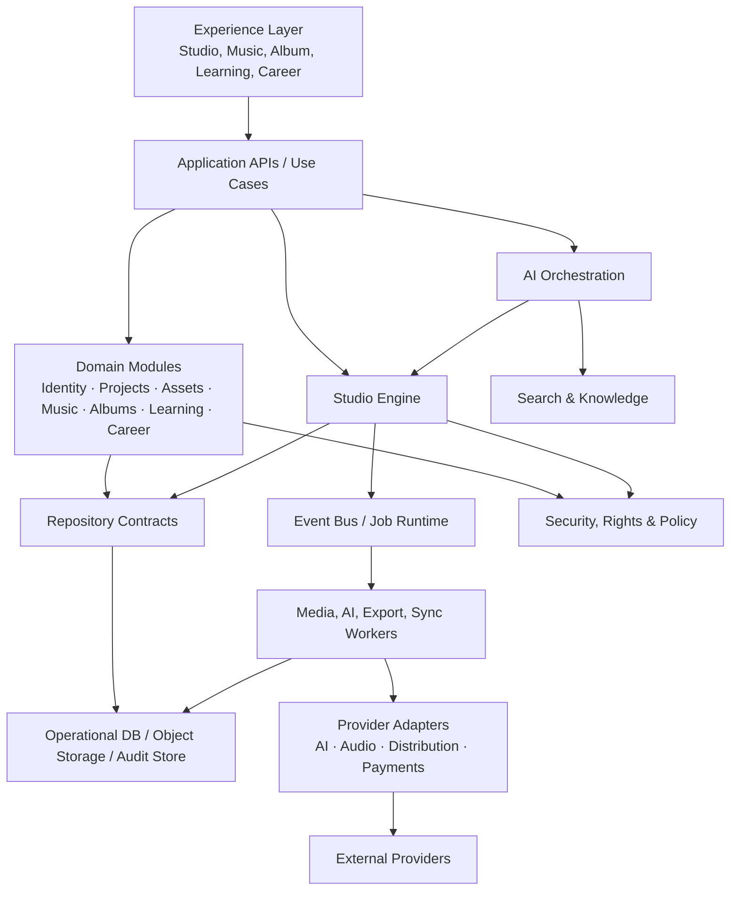

# Silent Crescendo Studio — Architecture V2

**Status:** Target architecture  
**Audience:** Product, engineering, design, data, and AI teams  
**Purpose:** A long-lived architectural blueprint for Silent Crescendo Studio. This is a product architecture, not an implementation specification.

## 1. Vision

Silent Crescendo Studio is an AI-assisted creative operating system for music artists. It gives an artist one coherent workspace to turn an idea into a released body of work: capture intent, generate and develop music, organize projects and albums, learn craft, plan a career, and retain ownership of the creative record.

The product must be artist-led. AI accelerates exploration, production, organization, and learning; it never obscures provenance, silently replaces an artist's choices, or becomes the system of record for rights. Every meaningful output is traceable to its source inputs, model/version, prompts, settings, and human decisions.

### Architectural principles

- **One artist workspace, many focused studios.** A shared project graph connects specialized product areas without forcing a monolith.
- **Human control and provenance by default.** Generated assets remain reviewable, versioned, attributable, and reversible.
- **Domain-first modularity.** Business capabilities own their rules and data boundaries; UI and AI providers do not.
- **Asynchronous creative work.** Generation, analysis, rendering, exports, and ingestion run as durable jobs with observable status.
- **Provider independence.** AI, audio processing, storage, and distribution vendors are replaceable adapters behind stable contracts.
- **Privacy, rights, and safety are foundational.** Consent, access controls, retention, moderation, and audit trails apply across the platform.
- **Progressive sophistication.** The same architecture supports a songwriter sketching a demo and a team managing a multi-release catalog.

---

## 2. Complete module structure

The product is organized as a modular platform. Each module may initially be deployed in a modular monolith, while preserving boundaries that allow later extraction into services.

```text
Silent Crescendo Studio
├── Experience Layer
│   ├── Studio Shell
│   ├── Artist Dashboard
│   ├── Project Workspace
│   ├── Music Workspace
│   ├── Album Workspace
│   ├── Learning Workspace
│   ├── Career Workspace
│   └── Admin & Support Console
├── Application Layer
│   ├── Identity & Workspace
│   ├── Project Management
│   ├── Asset & Media Library
│   ├── Music Creation
│   ├── Album & Release Management
│   ├── Learning
│   ├── Career Planning
│   ├── AI Orchestration
│   ├── Collaboration & Notifications
│   ├── Search & Knowledge
│   └── Billing & Entitlements
├── Studio Engine
│   ├── Creative Graph
│   ├── Versioning & Provenance
│   ├── Workflow Orchestration
│   ├── Job Runtime
│   ├── Rules & Policy
│   └── Export/Publishing Pipeline
├── Platform Layer
│   ├── Repository Layer
│   ├── Event Bus
│   ├── Object Storage & Media Processing
│   ├── Search Index
│   ├── Cache
│   ├── Observability & Audit
│   ├── Security & Privacy
│   └── External Integrations
└── Data Layer
    ├── Operational Database
    ├── Vector/Knowledge Store
    ├── Analytics Warehouse
    └── Immutable Audit/Provenance Store
```

---

## 3. Module responsibilities

| Module | Responsibilities | Owns |
|---|---|---|
| Studio Shell | Navigation, global context, command palette, session recovery, feature access presentation. | Current workspace/project context and UI preferences. |
| Identity & Workspace | Authentication, authorization, memberships, roles, organizations, consent, artist profiles. | User, workspace, membership, role, consent. |
| Project Management | Creates and governs creative projects from idea to archive; manages milestones, briefs, tasks, decisions, and collaborators. | Project, brief, milestone, task, decision. |
| Asset & Media Library | Ingests, stores, tags, previews, versions, and rights-labels files and generated artifacts. | Asset metadata, rendition, folder/collection, rights metadata. |
| Music Creation | Captures song ideas and manages lyrics, composition, arrangement, sessions, stems, mixes, masters, and technical metadata. | Song, composition, arrangement, session, musical artifact. |
| Album & Release Management | Curates tracks into albums/releases; manages sequence, artwork, credits, metadata, release readiness, and distribution packages. | Album, release, track order, credit, release package. |
| Learning | Delivers structured learning paths, lessons, exercises, assessments, feedback, and artist skill progression. | Curriculum, lesson, exercise, progress, competency. |
| Career Planning | Turns creative goals into a practical career plan: objectives, campaigns, opportunities, contacts, budgets, and outcomes. | Career plan, campaign, opportunity, contact, budget. |
| AI Orchestration | Classifies requests, gathers approved context, selects providers/tools, runs guarded workflows, stores results and provenance. | AI request, run, model configuration, evaluation, safety decision. |
| Collaboration & Notifications | Sharing, permissions, comments, mentions, approvals, activity feed, in-app/email/push notifications. | Comment, approval, notification, activity entry. |
| Search & Knowledge | Full-text/semantic retrieval across permitted projects, assets, learning, notes, and generated metadata. | Search documents, embeddings, retrieval policies. |
| Billing & Entitlements | Plans, usage limits, metering, invoices, feature entitlements, team seats. | Subscription, entitlement, usage ledger. |
| Studio Engine | Executes cross-domain creative workflows and preserves graph relationships, state transitions, and provenance. | Workflow state, creative graph edges, job state, export manifest. |
| Repository Layer | Isolates persistence and queries behind domain repositories; enforces transactional and tenancy boundaries. | Persistence contracts and data access implementations. |
| External Integrations | Adapters for AI models, DAWs, audio tools, storage, distributors, calendar/CRM, analytics, and payment vendors. | Provider configuration, connection state, sync cursors. |
| Admin & Support Console | Moderation, support impersonation with audit, feature flags, operational dashboards, recovery tools. | Support cases, moderation actions, feature configuration. |

---

## 4. Dependency diagram

Dependencies point inward: experience and integrations depend on application contracts; application modules depend on domain contracts and the Studio Engine; the engine depends on platform abstractions, never provider SDKs directly.



### Dependency rules

1. A domain module may reference another domain only through published contracts or domain events.
2. UI components call application use cases; they do not query storage or call model providers directly.
3. Repositories return domain entities/value objects, not transport or ORM models.
4. Provider adapters implement ports owned by the application/engine layers.
5. Cross-module changes are coordinated by the Studio Engine or event handlers, not shared-table writes.
6. Audit, entitlement, tenancy, and rights policy checks occur at command boundaries and before external work starts.

---

## 5. Data flow

### Command flow

```text
Artist action → UI validation → Application use case → authorization/entitlement/policy
→ domain decision → transactional repository write → domain event → outbox
→ event bus → asynchronous workers/integration adapters → status and activity updates → UI refresh
```

### Media and generated-output flow

```text
Upload or generated bytes → malware/type validation → quarantined object storage
→ metadata extraction/transcoding/waveform generation → approved asset record
→ version + provenance links → searchable index → project/album use
```

### Read flow

```text
Workspace context → authorization filter → read model / repository query
→ optional search or graph enrichment → API view model → UI
```

All asynchronous mutations use an outbox/idempotency pattern. A command receives a durable operation ID; retries must not create duplicate assets, releases, provider calls, or billing usage.

---

## 6. AI workflow

AI is a governed capability, not a separate product silo.

1. The artist selects an intent (for example: develop lyrics, analyze a mix, create a campaign plan, explain a lesson) and explicitly chooses the context to share.
2. AI Orchestration validates identity, entitlement, consent, rights restrictions, and policy for the requested operation.
3. A context builder retrieves only authorized, relevant information from the creative graph, media metadata, knowledge store, and user instructions.
4. The workflow router chooses an approved prompt template, tool chain, model profile, and cost/latency tier.
5. The request is queued as an observable AI run. Long-running or generative work runs through the job runtime.
6. Safety, copyright-risk, privacy, and output-quality gates evaluate the result. Unsafe or uncertain results are held for review or returned with an explanation.
7. Results are presented as a draft, suggestion, or generated asset. The artist may accept, edit, regenerate, compare, or discard.
8. Accepted outputs become versioned graph nodes. The system records input references, prompt/template version, provider/model version, tool parameters, timestamp, safety decisions, and human approval.
9. Evaluation signals—acceptance, edits, ratings, and failures—feed the internal evaluation dataset. They do not become training data without explicit consent.

AI must never make an irreversible release, rights, billing, or collaborator-permission decision without a human approval step.

---

## 7. Music generation workflow

```mermaid
flowchart LR
  A["Creative brief\nMood, genre, references, constraints"] --> B["Generation request"]
  B --> C["Rights + policy validation"]
  C --> D["Generate / transform job"]
  D --> E["Audio QA\nformat, duration, loudness, safety"]
  E --> F["Asset library\npreview + metadata + provenance"]
  F --> G["Artist review\ncompare, edit, approve"]
  G --> H["Song / arrangement / session version"]
  H --> I["Mix, master, export, or album placement"]
```



The workflow supports ideation outputs (motifs, chord progressions, lyric variations), generated audio, transformations, stem separation, arrangement assistance, mix/master analysis, and export preparation. Each generated result is immutable at the byte level; editing creates a derivative version linked to its parents. Generation must expose applicable usage terms before approval and must retain a provider-independent rights/provenance record.

---

## 8. Album workflow

1. Create an album project with artistic brief, target audience, format, target date, and commercial/release objectives.
2. Link existing or new song projects; establish album-level creative direction and completion criteria.
3. Develop candidate tracks through the Music workspace. The album curator views readiness, rights, mix/master status, and missing metadata per track.
4. Sequence tracks, maintain alternates, define interludes/versions, and model album editions without duplicating underlying musical works.
5. Create/select artwork and package visual, lyric, credit, and metadata assets.
6. Run release-readiness gates: ownership/rights, contributor credits, ISRC/UPC and territory metadata, explicit-content labels, technical audio checks, accessibility, and approved masters.
7. Assemble a versioned release package and route it for human approvals.
8. Export to distribution adapters or a downloadable package; record submission status and immutable package manifest.
9. Connect post-release campaign outcomes back to the album and career plan.

An album is a curated container and release plan; a song, sound recording, asset, and release remain distinct entities so the catalog can support reissues, singles, deluxe editions, and multiple territories.

---

## 9. Project workflow

Projects are the primary unit of focused creative work.

```text
Inbox idea → Project created → Brief and goals defined → Plan/milestones created
→ Create and collect assets → AI-assisted iteration and collaborator review
→ Decision/approval checkpoints → Deliverables complete → Archive, reuse, or promote to album/release
```

Every project has an owner workspace, visibility rules, lifecycle state (`idea`, `active`, `review`, `completed`, `archived`), a creative brief, linked graph entities, activity timeline, and a decision log. Templates provide standard workflows for song, album, campaign, practice plan, learning exercise, and custom creative work.

---

## 10. Learning workflow

1. The artist sets goals or completes an optional diagnostic.
2. Learning creates a personalized but explainable path based on stated goals, skill profile, preferred style, available time, and prior work.
3. A lesson presents concepts, references, demonstrations, and a concrete exercise.
4. The artist submits an exercise, links an existing project/asset, or records a reflection.
5. Feedback may combine rubric logic, AI-assisted coaching, and human mentor review; it clearly labels the source and confidence of feedback.
6. Progress updates competencies, portfolio evidence, and recommended next actions.
7. Completed work can be promoted into a project, song, or career portfolio item without copying files or losing provenance.

Learning recommendations must remain supportive and transparent. They cannot assert professional readiness or make consequential career decisions solely from automated assessment.

---

## 11. Career workflow

```text
Artist profile + ambitions → career plan → measurable objectives
→ campaigns / opportunities / relationship actions → execution tasks and content
→ outcome capture → reflection and plan adjustment
```

The Career module connects creative output to sustainable artist development. It manages artist positioning, goals, release campaigns, milestones, opportunities, contacts, budgets, content calendars, and results. It consumes approved album/release and project milestones, but keeps sensitive contacts and business information under strict workspace permissions. AI may draft plans, outreach, bios, or retrospectives, but sends nothing externally and changes no public profile without approval.

---

## 12. Database structure

### Storage topology

| Store | Purpose |
|---|---|
| Relational operational database | Transactional domain records, workflow states, memberships, metadata, and references. |
| Object storage | Original files, audio renditions, previews, artwork, exports, and package manifests. |
| Search index | Permission-filtered keyword search and faceting across entities and extracted metadata. |
| Vector/knowledge store | Embeddings for authorized semantic retrieval and learning/AI context. |
| Analytics warehouse | De-identified product events, aggregate usage, funnels, and operational metrics. |
| Audit/provenance store | Append-only compliance events, AI lineage, approval evidence, and critical action history. |

### Core relational domains

| Domain | Principal entities |
|---|---|
| Tenancy & identity | `users`, `workspaces`, `memberships`, `roles`, `permissions`, `consents`, `sessions` |
| Creative graph | `graph_nodes`, `graph_edges`, `tags`, `references`, `versions`, `provenance_records` |
| Projects | `projects`, `project_briefs`, `milestones`, `tasks`, `decisions`, `project_templates` |
| Assets & media | `assets`, `asset_versions`, `renditions`, `media_metadata`, `storage_objects`, `rights_assertions` |
| Music | `songs`, `compositions`, `arrangements`, `recordings`, `sessions`, `stems`, `mixes`, `masters`, `lyrics` |
| Albums & release | `albums`, `album_tracks`, `releases`, `release_editions`, `credits`, `identifiers`, `distribution_packages` |
| AI | `ai_requests`, `ai_runs`, `ai_inputs`, `ai_outputs`, `model_profiles`, `prompt_versions`, `evaluations`, `safety_reviews` |
| Learning | `learning_paths`, `lessons`, `exercises`, `submissions`, `assessments`, `competencies`, `progress_records` |
| Career | `career_plans`, `objectives`, `campaigns`, `opportunities`, `contacts`, `budgets`, `outcomes` |
| Collaboration | `comments`, `mentions`, `approvals`, `notifications`, `activity_events`, `shares` |
| Commerce & operation | `subscriptions`, `entitlements`, `usage_ledger`, `audit_events`, `integration_connections`, `sync_jobs` |

### Data rules

- Every tenant-owned record contains `workspace_id`; every query is tenant-scoped.
- Entities use stable IDs, `created_at`, `updated_at`, actor attribution, and optimistic concurrency/version fields where collaborative edits occur.
- Files live in object storage; relational rows contain object references, checksums, technical metadata, and access policy—not file bytes.
- Destructive actions are soft-delete/retention-driven by default. Published packages, approvals, and audit events are append-only.
- Personally identifiable, contractual, and payment data have explicit classification, access logs, retention policies, and encryption requirements.
- Graph edges carry relationship type, source, confidence where applicable, and provenance to enable traceable creative lineage.

---

## 13. Repository layer

The repository layer is the only persistence boundary used by domain/application code. It prevents storage technology, ORM choices, and query optimization from leaking into business rules.

### Responsibilities

- Define repository interfaces per aggregate or read model: for example `ProjectRepository`, `AssetRepository`, `SongRepository`, `AlbumRepository`, `AIrunRepository`, and `CareerPlanRepository`.
- Enforce workspace scope, authorization context, soft-delete behavior, and consistent pagination.
- Coordinate atomic writes through unit-of-work/transaction boundaries.
- Persist domain events into an outbox in the same transaction as state changes.
- Provide optimized query/read-model repositories for dashboards, readiness views, search facets, and timelines.
- Manage concurrency conflicts explicitly rather than silently overwriting creative changes.
- Keep migrations, indexing strategy, and storage-schema concerns behind infrastructure implementations.

Repositories do not contain workflow orchestration, prompt construction, UI formatting, provider calls, or cross-domain business policy.

---

## 14. Service layer

Services implement application use cases and expose stable APIs to the experience layer and external clients.

| Service category | Examples | Responsibilities |
|---|---|---|
| Command services | Create Project, Approve Master, Add Track to Album | Validate request, authorize, call domain behavior, persist atomically, publish events. |
| Query services | Project Dashboard, Album Readiness, Artist Timeline | Assemble permission-filtered read models without side effects. |
| Domain services | Release Readiness, Credit Resolution, Rights Evaluation | Apply business rules spanning multiple aggregates. |
| Orchestration services | Generate Music, Build Release Package, Learning Recommendation | Start/resume long-running workflows through the Studio Engine. |
| Integration services | Distribution Sync, Storage Ingestion, Payment Webhook | Translate external protocols into internal commands/events; isolate retries and failures. |

Service APIs are versioned, idempotent for commands, and consistently return operation status for asynchronous work. The API boundary is the appropriate place for transport validation and rate limiting; authorization and business invariants remain enforced deeper as well.

---

## 15. Studio Engine

The Studio Engine is the product's coordination core. It is not an audio model or a UI feature. It understands the lifecycle and relationships of creative work across modules.

### Engine responsibilities

- Maintain the **Creative Graph** connecting ideas, briefs, assets, versions, songs, recordings, albums, lessons, campaigns, and releases.
- Execute durable workflows with state machines, checkpoints, compensation/retry policies, and human approval gates.
- Manage creative version lineage, branching, comparisons, and promotion of drafts to approved deliverables.
- Route background jobs for generation, media processing, metadata extraction, quality analysis, exports, and integrations.
- Evaluate readiness rules for project completion, track approval, album release, learning exercises, and campaign milestones.
- Capture provenance and audit context automatically for all engine-managed actions.
- Produce portable export manifests that identify source assets, versions, metadata, approvals, and rights assertions.

### Core engine interfaces

```text
WorkflowDefinition → WorkflowInstance → Step / Approval / Job → Event → Readiness Result
CreativeNode + CreativeEdge → Version Lineage → Provenance Manifest
Command → Policy Check → State Transition → Outbox Event
```

The engine should start as a well-bounded internal module backed by durable queues and relational state. Extract it as an independent service only when workflow volume, deployment cadence, or team ownership makes that operationally necessary.

---

## 16. Future AI integrations

Future AI capabilities are integrated through provider-neutral ports, capability registration, evaluations, and policy gates.

| Capability | Product value | Required guardrails |
|---|---|---|
| Multimodal creative copilot | Conversational guidance across text, audio, images, and project context. | Explicit context selection, citation/provenance, permission-filtered retrieval. |
| Music generation and transformation | Ideas, variations, stems, sound design, arrangement assistance. | Rights disclosure, provider terms, audio watermark/provenance where available, human approval. |
| Mix/master intelligence | Technical analysis and actionable production feedback. | Explainable metrics, no claim of universal aesthetic correctness. |
| Lyric and composition assistant | Ideation, structure, co-writing exercises, language support. | Reference controls, originality/copyright-risk guidance, source separation. |
| Artist knowledge agent | Search and summarize the artist's own catalog, notes, and learning. | Workspace isolation, source links, opt-in indexing. |
| Learning coach | Adaptive lesson plans and formative feedback. | Transparent rubrics, confidence labels, human escalation. |
| Career strategist | Draft campaign plans, bios, content calendars, and retrospectives. | No autonomous outreach, publishing, spending, or contractual advice. |
| Collaboration intelligence | Summarize feedback, identify blockers, prepare handoffs. | Preserve attribution, do not suppress dissenting feedback. |

Every new provider or model must pass an integration review covering data residency, terms, rights, security, quality benchmarks, cost limits, failure behavior, observability, and an exit/migration strategy.

---

## 17. Development roadmap

### Phase 0 — Foundations

Establish workspace identity, role-based access, design system, operational database, object storage, repository conventions, audit logging, event outbox, observability, and security/privacy baseline. Define the creative graph and provenance model before building generation features.

### Phase 1 — Artist workspace MVP

Deliver project management, asset ingestion/library, core music entities, project timeline, collaboration basics, search, and a version-aware Studio Engine. Focus on artist-owned organization and reliable creative continuity.

### Phase 2 — AI-assisted creation

Introduce AI Orchestration, prompt/model governance, approved-context retrieval, asynchronous AI runs, provenance UI, and initial text/audio-assistance workflows. Build evaluation and cost-control systems alongside the first capability, not later.

### Phase 3 — Album and release operations

Deliver album curation, track sequencing, credits, metadata, readiness rules, release packages, approval workflows, and distribution adapter foundations. Make release export reproducible and auditable.

### Phase 4 — Learning and career

Add learning paths, exercises, portfolio links, career planning, campaigns, opportunities, budgets, and outcome measurement. Connect these modules through the creative graph rather than duplicating project data.

### Phase 5 — Ecosystem and scale

Add DAW/import-export integrations, richer distribution and analytics adapters, team/label workflows, advanced semantic knowledge, provider marketplace capability, and selective service extraction based on measured bottlenecks.

### Continuous architecture work

At every phase, maintain contract tests for provider adapters, workflow reliability tests, tenant-isolation/security tests, migration rehearsals, AI evaluations, accessibility validation, performance budgets, backup/recovery drills, and operational runbooks. Architecture decisions should be recorded as short ADRs whenever a boundary, storage model, external dependency, or irreversible product rule changes.

---

## Success criteria

The architecture is successful when an artist can trace any released asset back through its versions, collaborators, decisions, rights assertions, and AI involvement; move fluidly between song, album, learning, and career work; safely recover from failed asynchronous work; and retain meaningful control as Silent Crescendo Studio adds new models, tools, teams, and distribution partners.
